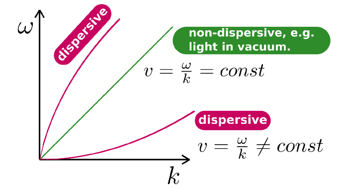
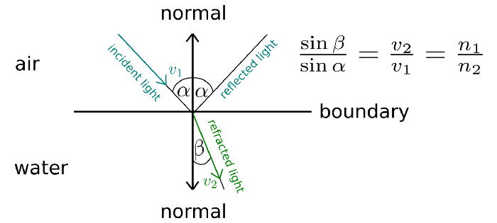

Радуги, кто мог бы остаться нетронутым, когда натыкаешься на них? С древних и до наших дней это предзнаменование грядущей удачи, успеха, счастья, только позитива и никаких катастроф. Однако неудивительно, что, поскольку люди чувствуют хорошие вибрации во время прекрасных явлений, они хотят связать их с согревающими сердце чувствами. Некоторые народные сказки и легенды идут еще дальше и материализуют это обещанием, что сундук с золотом, охраняемый гномом, ждет в конце радуги. Независимо от того, ждет ли охотников за сокровищами сундук с золотом или нет, радуги не перестанут радовать глаз.
Я был любознательным ребенком. Я помню, что продолжал спрашивать обо всем, не принимая ответа “так оно и есть”. Мне нужно было знать, иначе я не смог бы заснуть — к счастью, я все еще такой. Я не могу смириться с неизвестностью. О, сколько у меня было бессонных ночей. В детстве, всякий раз, когда я слышал “радугу в небе”, я был там быстрее, чем Усэйн Болт во время олимпийского спринта на 100 метров. И я уверен, что у всех детей есть и было одно и то же.
Предварительный
Что же тогда вызывает радугу в небе?
Секрет заключается в том, что белый свет представляет собой наложение других цветов и рассеивается при перемещении между диспергирующими средами. Все цвета, создающие белый свет, имеют немного разную частоту, что влияет на их скорость в этих средах. Что, в свою очередь, приводит к различным углам преломления. Таким образом, при прохождении через среду цвета постоянно расходятся сами по себе, а при выходе из среды они появляются как отдельные люди.
Что означает дисперсионная среда?
Это означает, что фазовая скорость,

задается соотношением ω (сколько радианов в секунду)

к k (сколько волн на метр,)

варьируется в зависимости от разных частот.
ω, k график. (собственная работа)

Это все, что есть.
Закон Снелла и угол, показатель преломления
Оптический инструмент, используемый для описания взаимосвязи между углами падения и преломления, которые измеряются относительно нормали разделяющей их границы; граница должна разделять две разные изотропные среды. Это естественное следствие того факта, что свет распространяется в соответствии с наименьшим действием времени. Математически говоря, он утверждает, что отношение синусов углов соответствует скоростям в этих двух средах.
Другими словами, он показывает, сколько света изгибается после того, как он проходит через границу.
Это также говорит о том, что падающий свет (если он не является полным отражением) отражается на границе под тем же углом, что и падающий.
Описание закона Снелла. (собственная работа)

Показатель преломления - это соотношение между скоростью света в вакууме и любой другой средой.

Поскольку радуги ограничены фиолетовым и красным цветом, разумно отметить их индексы.

