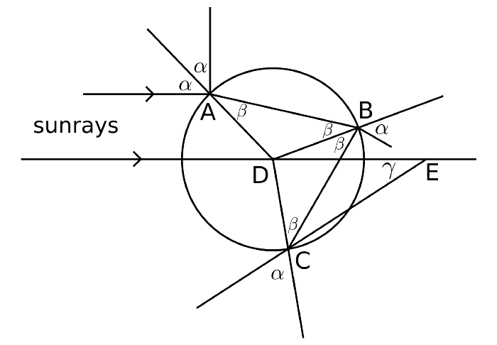
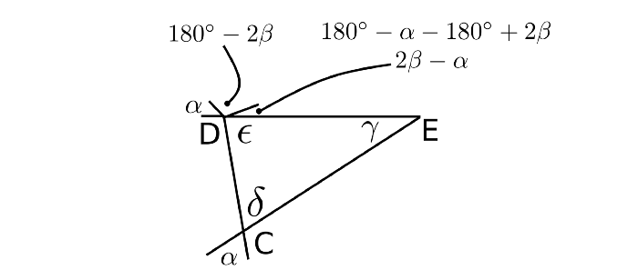
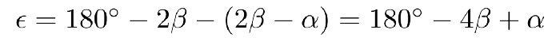
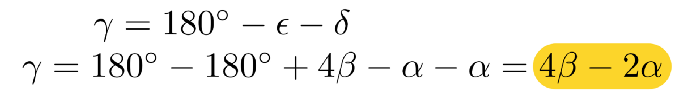
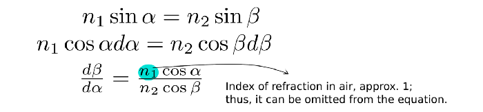
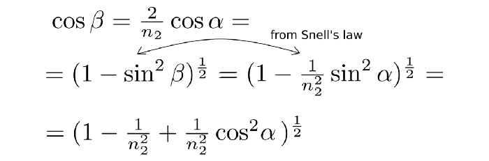
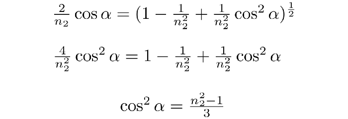
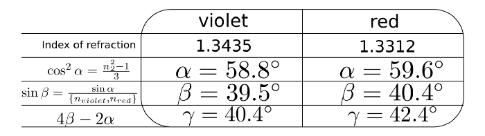
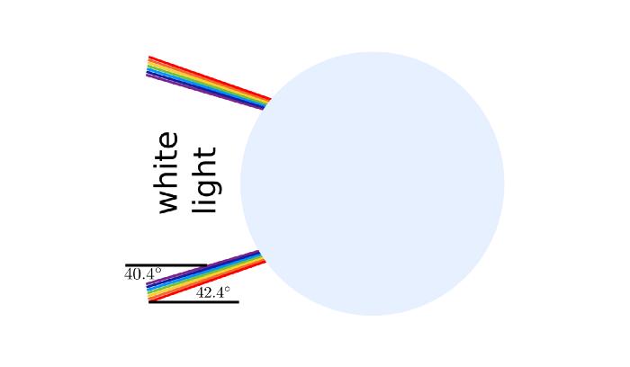
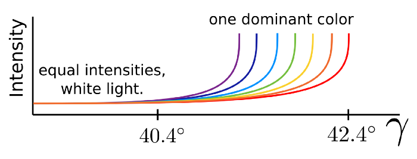

Ключ к пониманию радуги лежит в рассеянии, возникающем, когда солнечный свет попадает на одну каплю воды.
Рассмотрим рисунок ниже и солнечный луч, который попадает на каплю воды в точке А.

Геометрия капли воды, на которую падают солнечные лучи. (собственная работа)
В этот момент часть света отражается; в результате чего остальная часть продолжает свое движение к точке В, во время которой цвета расходятся сами по себе. Наконец, эта часть света попадает на каплю воды в точке B.
Есть ли какая-то причина изучать свет, который оставляет здесь капля воды?
— Нет, потому что радуги видны, если смотреть в сторону от Солнца.
Следовательно, следование за светом ведёт к С. Поскольку этот свет заметен, если смотреть в сторону от Солнца, его стоит проанализировать.
Каждое доказательство требует количества (-ов), которые обобщают проблему на все случаи. В этой задаче это γ, которое определяет диапазон углов, под которыми лучи могут покидать каплю воды в точке C.

Вычисление γ
Углы δ и ε треугольника CDE на рисунке выше имеют решающее значение для нахождения γ; их получение дает γ.
Треугольник CDE. 

Давайте выясним их, заполнив все углы выше их значениями.
Вычисление γ в треугольнике CDE.

Таким образом, δ совпадает с α, при этом ε равно

Что дает γ, равное

Таким образом, знание углов падения (α) и преломления (β) позволяет определить, под каким углом лучи покидают каплю воды. Это огромный шаг вперед.
Вычисление производной γ по α и проверка, когда она равна нулю
Почему вообще производная?
Потому что это позволяет определить все стационарные точки функции, для которой вычисляется: минимумы, максимумы.
Почему по отношению к α?
Поскольку α - это угол падения, он показывает, какой путь проходит свет в капле воды относительно ее точки входа. Более того, β зависит от α.
Так

Из закона Снелла

Подключаю его обратно

Продолжающийся

Окончательно

Теперь, включив в это уравнение показатели преломления красного и фиолетового света, можно определить углы падения, при которых γ имеет максимум. Но для вычисления γ сначала необходимо оценить β. Тогда оба, α и β, могут быть включены в уравнение γ.
Резюме
Таблица, показывающая промежуточные шаги для расчета γ max для фиолетового и красного цветов.

Результаты означают, что каждый цвет создает отдельный световой конус в диапазоне от 0° до его γ max.

Конус разных огней, выходящий из капли воды. (собственная работа)

Последний неизвестный
Одна загадка остается неразгаданной, а именно, если каждый цвет может выходить из капли воды под любым углом, вплоть до максимального значения γ, то почему они не перекрываются друг с другом, создавая некоторую смесь цветов с доминирующим белым светом?
Из-за различной интенсивности цветов то, что человеческий мозг воспринимает как цвет, является превышением одного над всеми остальными. На диаграмме это выглядит примерно так же, как показано ниже.
Интенсивности разных цветов по отношению к γ. (не в масштабе)

