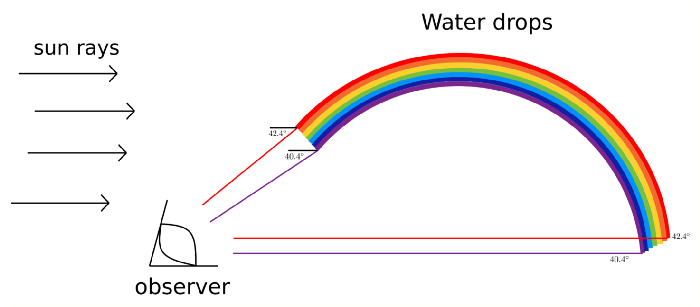

От одной капли воды до радуги ведет недолгая дорога. Недостающая часть заключается в том, как капли воды работают вместе, образуя единое целое.
Развитие радуги в небе, как видно с земли. 

Представьте себе воду, подвешенную в воздухе. Солнечный свет непрерывно воздействует на десятки молекул. В каждом из них солнечный свет отражается и преломляется, как было показано. Таким образом, если вы направите голову в сторону от Солнца на 42,4°, вы увидите красный свет. Но этот и любой другой цвет исходит не от одной молекулы, а от всех под соответствующим углом. Это означает, что, когда наблюдатель находится на земле, молекулы, возвращающие заданный цвет (как видно наблюдателю), выстраиваются в форме дуги. Следовательно, общий эффект - это коллективная работа всех капель воды

